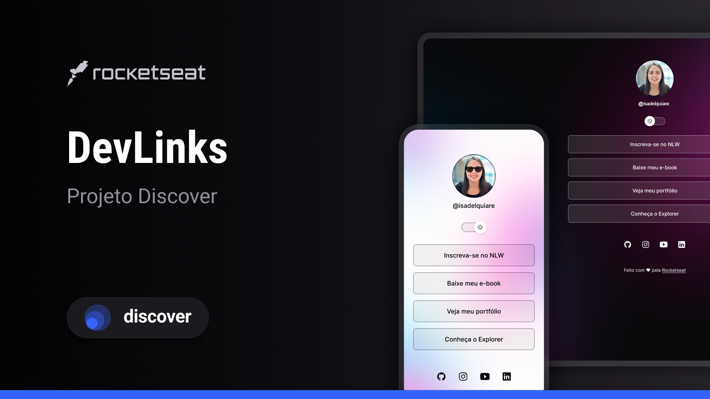

<h1 align="center"> DevLinks </h1>

Curso de Discord promovido pela Rocketseat para ensino de tecnologias WEB.

  <a href="#-tecnologias">Tecnologias</a>&nbsp;&nbsp;&nbsp;|&nbsp;&nbsp;&nbsp;
  <a href="#-projeto">Projeto</a>&nbsp;&nbsp;&nbsp;|&nbsp;&nbsp;&nbsp;
  <a href="#-Layout">Layout</a>&nbsp;&nbsp;&nbsp;|&nbsp;&nbsp;&nbsp;
  <a href="#memo-licença">Licença</a>&nbsp;&nbsp;&nbsp;|&nbsp;&nbsp;&nbsp;

 

  

## Tecnologias

Esse projeto foi desenvolvido com as seguintes tecnologias:
- HTML e CSS
- JavaScript
- Git e Github
- Figma

## Projeto

O DevLinks é um agregador de links para usar como cartão de visitas online.

## :memo: Licença

Esse projeto está sob licença MIT.

---

Feito por mim com ♥!
